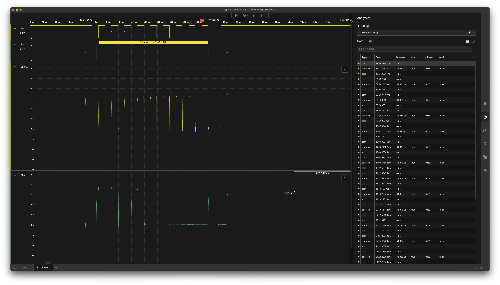

# I2C First Contact

This past weekend I was able to make first contact with the IMU I'll be using for my drone from scratch project using my custom I2C driver. I just wanted to share a little about what I actually did and how.

> First ack from the MPU 6050 gyroscope and accelerometer.
