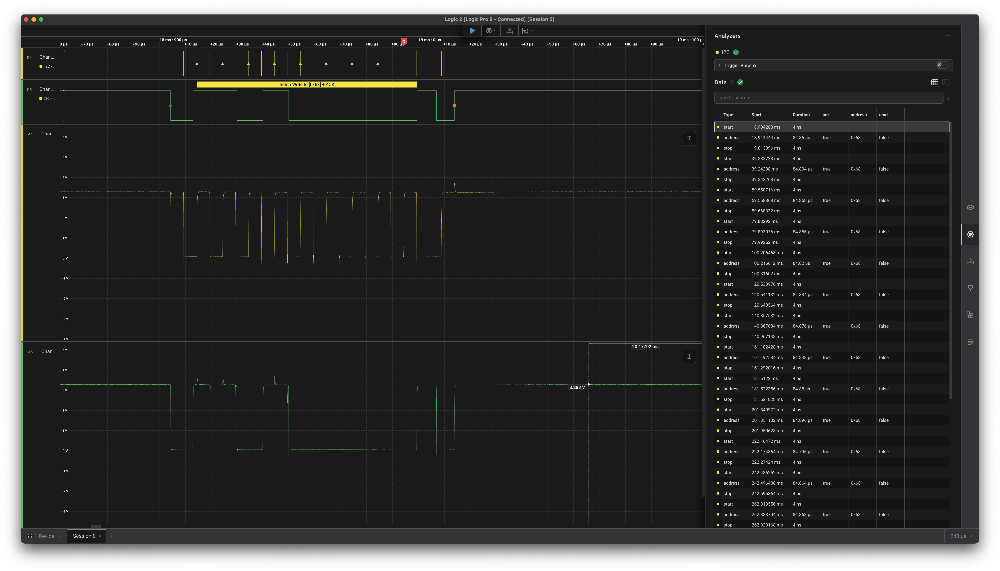
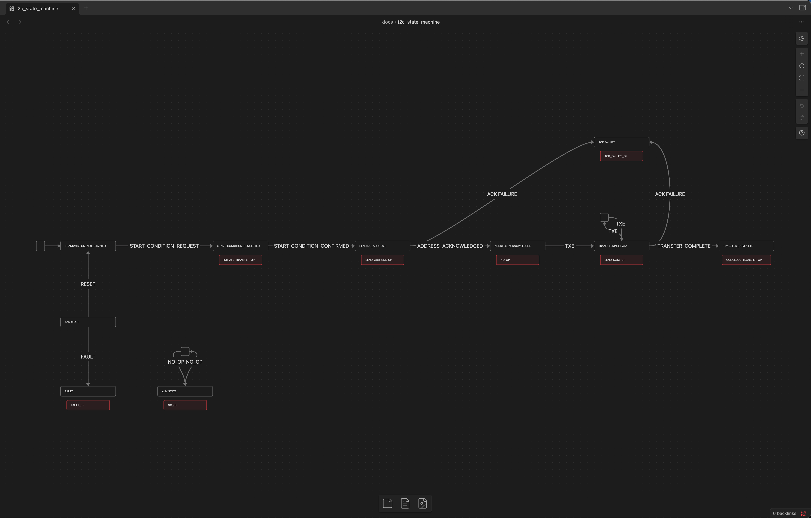

# I2C First Contact

> First ack from the MPU 6050 gyroscope and accelerometer. Red vertical line marks ack on the 9th clock pulse confirmed by SDA (in green) pulled low.

This past weekend I was able to make first contact with the IMU I'll be using for my drone from scratch project using my custom I2C driver. I just wanted to share a little about what I actually did and how.
## Where We Left Off Last Time
In my last post, [I2C First Signs of Life](./2025-07-25-i2c-first-signs-of-life.md), I initialized the I2C peripheral and was able to put an address on the bus. But there was a problem with that implementation - it was a polling-based driver. This meant that any time I wanted to read or write using I2C, my main loop was blocked from servicing the data streams in and out of UART because it was too busy polling the hardware status of the I2C peripheral. In the context of the [Drone Project](./2025-07-22-drone-from-scratch.md), this is unacceptable, because the control loop relies on running at a consistent frequency. So, the next thing that had to be done was a conversion to an interrupt-based version of the driver.
## Interrupt-Based I2C Driver
I wrote six different attempts of an interrupt driven design that all ended up being tossed in the garbage before I ended up with this one (which I can entirely imagine throwing away too in the near future). I2C ended up being much more challenging for me than the UART driver. The core difficulty relied on managing the concept of state within a given I2C transaction. First, you request the hardware to generate a start condition on the bus, then wait for confirmation that the start signal was generated, then send an address, then wait for an acknowledge signal, and so on. During either an iteration of the main loop or an interrupt call I continually had to wrestle with the state. Why was this interrupt generated? Does it match what the current transaction was expecting? How much does the hardware keep track of and how much am I responsible for? I continually had to ask, what's going on and what should I do next? The six different attempts prior to this one each used progressively complex ways of keeping track of what is going on and calculating what should be done next in consequence. They were canned as their duplication became apparent, or their overhead too heavy, or their spaghetti knots too tangled, until at last, some semblance of simplicity emerged.


> I2C Transmit State Machine. States in boxes. Events are arrows. Red boxes represent callbacks that perform operations based on the state change.

It turns out that the hardware manages most of this for you if you let it. The I2C peripheral has its own state machine implemented in hardware that aids the programmer in the transaction. For the most part, it will call the interrupts at the right time in the right order. Even so, the main loop needs *some* idea of what's going on so it doesn't try to add a new message in the middle of the current transmission. My state that I needed to keep track of was reduced to one thing really, are we in the middle of a transmission, or not? If not, I can pop a message off the queue and load it into a place where the ISR can work on it in peace and set `_tx_in_progress = true`, then generate the `START CONDITION`, and away it goes. If a transmission is in progress, don't touch anything while the ISR works. This code runs in a `message_queue_servicer()` function in the main loop. My ISRs and the message servicer looked a little something like this:

```
/* Private variables */
static volatile uint8_t  _addr      = 0;
static volatile uint8_t  _data[MAX_MESSAGE_DATA_LEN];
static volatile size_t   _data_len  = 0;
static volatile size_t   _tx_pos    = 0;
static volatile uint8_t  _tx_last_written = 0; // 1 after writing final byte
static volatile bool     _tx_in_progress = false;

void I2C1_EV_IRQHandler(void)
{
    uint32_t sr1 = I2C1->SR1;  // volatile read ok

    // START bit: cleared by reading SR1 then writing DR with address
    if (sr1 & I2C_SR1_SB)
    {
        (void)I2C1->SR1;                // read to clear SB
        I2C1->DR = (_addr << 1) | 0;     // write direction = write
    }

    // Address sent/ack: clear by SR1 then SR2 read
    if (sr1 & I2C_SR1_ADDR)
    {
        (void)I2C1->SR1;
        (void)I2C1->SR2;
        I2C1->CR2 |= I2C_CR2_ITBUFEN;   // allow TXE/RXNE interrupts
    }

    // If we already wrote the last byte, wait for BTF then STOP
    if ((sr1 & I2C_SR1_BTF) && _tx_last_written)
    {
        I2C1->CR1 |= I2C_CR1_STOP;
        I2C1->CR2 &= ~I2C_CR2_ITBUFEN;  // no more buffer IRQs
        _tx_last_written = 0;
        _tx_in_progress = false;
        return;
    }

    // TXE: feed next byte if any
    if (sr1 & I2C_SR1_TXE)
    {
        if (_tx_pos < _data_len)
        {
            I2C1->DR = _data[_tx_pos++];
            if (_tx_pos == _data_len)
            {
                // we just queued the final byte; arm BTF to finish
                _tx_last_written = 1;
            }
        }
        else
        {
            // Nothing to send (e.g., zero-length write)
            I2C1->CR2 &= ~I2C_CR2_ITBUFEN;
            I2C1->CR1 |= I2C_CR1_STOP;
            _tx_in_progress = false;
        }
    }

    // todo: handle STOPF in slave mode, RXNE for reads, etc.
}

void I2C1_ER_IRQHandler()
{
    uint32_t sr1 = I2C1->SR1;  // volatile read ok

    if (sr1 & I2C_SR1_AF)
    {
        // The slaved failed to acknowledge either address or data.
        I2C1->SR1 &= ~I2C_SR1_AF; // Reset flag.
        // Send STOP condition
        I2C1->CR1 |= I2C_CR1_STOP;
        _tx_in_progress = false;
    }
}
```

```
// Called from main loop
HalStatus_t hal_i2c_message_servicer()
{
    HalStatus_t status = HAL_STATUS_ERROR;

    // CRITICAL SECTION ENTER
    NVIC_DisableIRQ(I2C1_EV_IRQn);
    NVIC_DisableIRQ(I2C1_ER_IRQn);

    // Check if I need to load in a new message for the hardware.
    if (!_tx_in_progress)
    {
        // Feed the next message.
        i2c_message_t msg;
        if (I2C_QUEUE_STATUS_SUCCESS == get_next_message(&msg))
        {
            // Message data
            _addr = msg.slave_addr;
            _data_len = msg.data_len;
            memcpy((void*)_data, msg.data, _data_len);

            // Control data
            _tx_pos = 0;
            _tx_last_written = 0;
            _tx_in_progress = true;

            // Send start
            I2C1->CR1 |= I2C_CR1_START;

            status = HAL_STATUS_OK;
        }
    }

    NVIC_EnableIRQ(I2C1_EV_IRQn);
    NVIC_EnableIRQ(I2C1_ER_IRQn);
    // CRITICAL SECTION EXIT

    return status;
}
```

With the Interrupt Driver Design at least somewhat in place, I absolutely *had* to talk to something.

## First Contact
Honestly, this part was surprisingly easy (comparatively). I just had to solder the headers onto my MPU 6050 and add it to the I2C bus on my bread board. I attached my logic analyzer to capture the communication. I used the reference manual to determine what address I should be sending to. I captured frames with both the correct address and incorrect address and noted the presence and absence of the ack signal respectively, until I felt very confident I was getting a positive acknowledgement from my IMU!


> Hardware setup for this test. Please forgive the mess. Bread board with IMU in the center. STM32 Microcontroller in white. Logic Analyzer in red.

## Next Steps
After actually taking a look at the reference manual for my IMU I would not be surprised if the interface or implementation of my driver changes substantially. When I began, I had an idea of how client code might want to use an I2C driver to communicate with a peripheral, but now I am not so sure. I think the very next step needs to be a proof of concept IMU driver that uses the I2C driver. Only by actually trying to build something on top will I get a feel for what the I2C driver needs to provide for it's clients. So I think I'd like to fetch the current orientation in space from the onboard gyroscope and print the values out over UART in real-time so I can see the numbers change as I tilt and rotate the IMU. Hopefully, that's my next post. Thank you for reading!